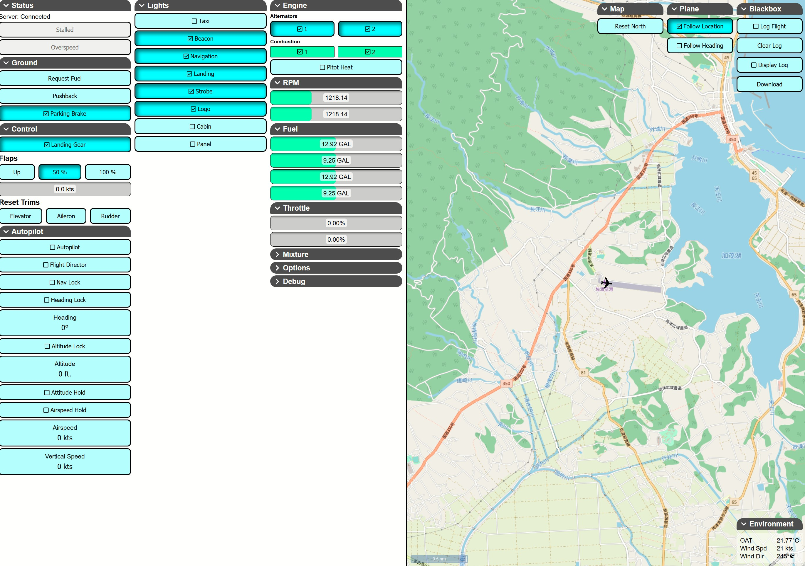

# GlassApp

Second device display for Flight Sim 2020.

# Using Glass

Available [here] (https://russleyshaw.github.io/GlassApp/)

Download the server [here](https://github.com/russleyshaw/GlassServer)

# Development

1. Download & Run Microsoft Flight Sim 2020

2. Download & Run [GlassServer](https://github.com/russleyshaw/GlassServer)
I'd recommend downloading the repo and trying to run master. This allows you to add any simvars/events that may not be added yet.

3. Install dependencies `yarn`
4. Run dev server `yarn dev`

A development server should be available at `http://localhost:8080`

NOTE: The dev server's host is currently set to 0.0.0.0, meaning it will be accessible externally. 

